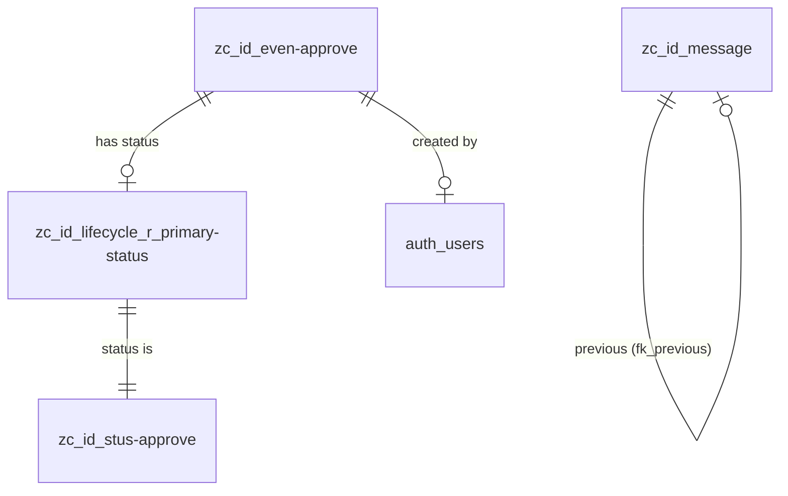

# Global Overview 本体规约 — Gateway TopBar WorkspaceDock 全局概览

> **归属**: Gateway 基础设施（`Gateway/backend/src/api/global_overview.rs`）
> **路由前缀**: `/api/global`
> **DB Schema**: `isahl` + `isahl_auth`
> **Alioth 模型版本**: v10.0.0+

## 1. 领域概述

Gateway TopBar 的 badge 计数和 WorkspaceDock 面板数据源。聚合跨模块的审批待办和站内信，供右侧面板使用。

**核心能力**:

- 待审批项聚合（审批工作区 badge 计数 + 面板内容）
- 站内信聚合（消息工作区 badge 计数 + 面板内容）

**访问控制**: 需有效 JWT；经 NgacEnforcer PDP 决策（无 `with_public_paths` 豁免——该方法已不存在，仅 `with_public_noauth_paths` 用于 `/api/auth` 等无 JWT 路径）。

- `GET /api/global/overview` → resource registry 解析为 `global:0`（PEP 注入 `x-visible-ids` 做 RLS 过滤，见 `Framework/backend/ngac-contract/src/resource_registry.rs`）
- `GET/POST /api/approvals/{id}[/approve|/reject]` → map_resource 解析为 `approvals:{id}`（PDP 决策，fail-close）

## 2. 实体定义

### 2.1 zc_id_even-approve — 审批事件

继承链：`zc_ad_tensor` ← `zc_ad_object` ← `zc_id_object` ← `zc_ad_variable` ← `zc_id_lifecycle` ← `zc_id_event` ← `zc_id_even-approve`

叶表（15 张）：`zc_id_appr-purchase`, `zc_id_appr-pricing`, `zc_id_appr-process`, `zc_id_appr-bid-evaluation`, ...

| DB 列           | 类型                               | 映射 DTO 字段                                   | 业务语义                                                   |
| --------------- | ---------------------------------- | ----------------------------------------------- | ---------------------------------------------------------- |
| `id`            | `bigint PK`                        | `ApprovalItem.id`                               | 审批事件 ID                                                |
| `notice`        | `text`                             | `ApprovalItem.title`                            | 审批标题                                                   |
| `code`          | `text`                             | `ApprovalItem.code`                             | 审批编号（如 `PO-2024-00123`）                             |
| `o_number`      | `text` (auto)                      | —                                               | 自动编号（现有 SQL 已从 `number`→`code`，不用 `o_number`） |
| `comments`      | `text`                             | —                                               | 审批备注                                                   |
| `created_by_id` | `bigint`                           | —（JOIN `auth_users`→`applicant`）              | 发起人 ID                                                  |
| `created_at`    | `timestamptz`                      | `ApprovalItem.time`（格式化为 `MM-DD HH24:MI`） | 发起时间                                                   |
| `fk_place`      | `bigint FK → zc_id_place.id`       | —                                               | 审批场所                                                   |
| `fk_subject`    | `bigint FK → zc_id_subjects.id`    | —                                               | 审批主体/被审批人                                          |
| `fk_process`    | `bigint FK → zc_id_process.id`     | —                                               | 审批流程                                                   |
| `lk_urgent`     | `bigint FK → zc_id_leve-urgent.id` | —                                               | 紧急程度等级                                               |
| `timeline`      | `jsonb`                            | —                                               | 审批时间线                                                 |
| `_f_`           | `text` (auto)                      | —                                               | 触发器赋值：六象限 _f_ 码                                  |
| `_t_`           | `text` (auto)                      | —                                               | 触发器赋值：六象限 _t_ 码                                  |
| `tpl_id`        | `bigint`                           | —                                               | 模板溯源（若从审批模板派生）                               |

### 2.2 zc_id_stus-approve — 审批状态

继承链：`zc_ad_tensor` ← `zc_ad_object` ← `zc_id_object` ← `zc_ad_scalar` ← `zc_ad_variable` ← `zc_id_status` ← `zc_id_stus-approve`

无叶表（自身为叶）。

| DB 列      | 类型          | 映射 DTO 字段         | 业务语义                                    |
| ---------- | ------------- | --------------------- | ------------------------------------------- |
| `id`       | `bigint PK`   | —                     | 状态 ID                                     |
| `notice`   | `text`        | —                     | 状态名称（如 "待审批"/"已通过"/"已驳回"）   |
| `code`     | `text`        | `ApprovalItem.status` | 状态代码（"pending"/"approved"/"rejected"） |
| `flag`     | `enum`        | —                     | 状态标志（start/middle/end）                |
| `enable`   | `boolean`     | —                     | 是否启用                                    |
| `comments` | `text`        | —                     | 状态说明                                    |
| `o_number` | `text` (auto) | —                     | 状态编号                                    |

### 2.3 zc_id_message — 站内信（父表）

继承链：`zc_ad_tensor` ← `zc_ad_object` ← `zc_id_object` ← `zc_ad_variable` ← `zc_id_lifecycle` ← `zc_id_message`

叶表（9 张）：`zc_id_msgs-system`, `zc_id_msgs-im`, `zc_id_msgs-email`, `zc_id_msgs-review`, `zc_id_msgs-chat_ai`, `zc_id_msgs-comments`, `zc_id_msgs-feedback`, `zc_id_msgs-telephone`, `zc_id_msgs-zchat`

| DB 列             | 类型                             | 映射 DTO 字段                                 | 业务语义                     |
| ----------------- | -------------------------------- | --------------------------------------------- | ---------------------------- |
| `id`              | `bigint PK`                      | `MessageItem.id`                              | 消息 ID                      |
| `notice`          | `text`                           | `MessageItem.title` / `MessageItem.from_user` | 消息标题 / 发件人            |
| `content`         | `text`                           | `MessageItem.content`                         | 消息正文                     |
| `comments`        | `text`                           | —                                             | 消息备注                     |
| `code`            | `text`                           | —                                             | 消息类型代码                 |
| `created_by_id`   | `bigint`                         | —                                             | 发送人 ID                    |
| `created_at`      | `timestamptz`                    | `MessageItem.time`                            | 发送时间                     |
| `fk_sender-addr`  | `bigint FK → zc_id_addr.id`      | —                                             | 发送方地址（系统发送时为空） |
| `fk_thread`       | `bigint FK → zc_id_message.id`   | —                                             | 所属会话线程（自引用）       |
| `fk_previous`     | `bigint FK → zc_id_message.id`   | —                                             | 上一条消息（自引用）         |
| `qk_date`         | `bigint FK → zc_id_scal-date.id` | —                                             | 消息日期标量                 |
| `ak_benefit_user` | `bigint[]`                       | —                                             | 受益用户（收件人）           |
| `ak_permit_user`  | `bigint[]`                       | —                                             | 授权用户                     |
| `ak_access_user`  | `bigint[]`                       | —                                             | 可访问用户                   |
| `ak_source`       | `bigint[]`                       | —                                             | 来源实体                     |
| `_f_`             | `text` (auto)                    | —                                             | 六象限 _f_ 码                |
| `_t_`             | `text` (auto)                    | —                                             | 六象限 _t_ 码                |
| `tpl_id`          | `bigint`                         | —                                             | 模板溯源                     |

**消息阅读状态**: 当前通过 `ak_benefit_user` 数组判断"消息是否送达当前用户"。`unread` 状态需接入阅读状态关系表（`zc_id_lifecycle_r_*` 或专用 `zc_id_msg-read-status`），当前硬编码 `true`。TODO。

### 2.4 zc_id_lifecycle_r_primary-status — 生命体↔主状态关系

| DB 列         | 类型          | 语义                                |
| ------------- | ------------- | ----------------------------------- |
| `id`          | `bigint PK`   | 关系 ID                             |
| `ref_left`    | `bigint`      | 生命体 ID（→ `zc_id_lifecycle.id`） |
| `ref_right`   | `bigint`      | 主状态 ID（→ `zc_id_status.id`）    |
| `status_date` | `timestamptz` | 状态变更时间                        |
| `r_ids`       | `text`        | 关系标识符                          |
| `notice`      | `text`        | 关系说明                            |

### 2.5 auth_users — 用户（isahl_auth schema）

| DB 列          | 类型        | 映射 DTO 字段            | 业务语义             |
| -------------- | ----------- | ------------------------ | -------------------- |
| `id`           | `bigint PK` | —                        | 用户 ID              |
| `display_name` | `text`      | `ApprovalItem.applicant` | 显示名称             |
| `name`         | `text`      | —                        | 真实姓名（fallback） |
| `username`     | `text`      | —                        | 用户名（fallback）   |

## 3. 关系图



## 4. API DTO → DB 映射

### 4.1 GET /global/overview

```
GlobalOverviewResponse
├── success: bool
└── data: GlobalOverviewData
    ├── approvals: Vec<ApprovalItem>
    │   ├── id        ← zc_id_even-approve.id
    │   ├── title     ← zc_id_even-approve.notice
    │   ├── applicant ← auth_users.display_name (via created_by_id)
    │   ├── dept      ← tableoid::regclass::text 派生（子串提取）
    │   ├── amount    ← zc_id_even-approve.o_number  （⚠️ 当前误用 a.number）
    │   ├── status    ← zc_id_stus-approve.code
    │   └── time      ← TO_CHAR(created_at, 'MM-DD HH24:MI')
    │
    └── messages: Vec<MessageItem>
        ├── id         ← zc_id_message.id
        ├── from_user  ← zc_id_message.notice (发送人名称)
        ├── title      ← zc_id_message.notice (消息标题)
        ├── content    ← zc_id_message.comments (正文)
        ├── time       ← created_at::text
        ├── unread     ← true (硬编码，待接入阅读状态)
        └── msg_type   ← tableoid::regclass::text 派生（子串提取）
```

### 4.2 DTO 字段映射详情

| DTO 字段                 | 来源                      | SQL 表达式                                                                      | 说明                                                            |
| ------------------------ | ------------------------- | ------------------------------------------------------------------------------- | --------------------------------------------------------------- |
| `ApprovalItem.id`        | `zc_id_even-approve.id`   | `a.id`                                                                          | 审批事件主键                                                    |
| `ApprovalItem.title`     | `notice`                  | `COALESCE(a.notice, '未命名审批')`                                              | 取审批事件名称                                                  |
| `ApprovalItem.applicant` | `auth_users`              | `COALESCE(u.display_name, u.name, u.username, '未知用户')`                      | 三级 fallback                                                   |
| `ApprovalItem.dept`      | `tableoid`                | `CASE WHEN tableoid = 'isahl.zc_id_even-approve' THEN '审批' ELSE replace(...)` | 从叶表表名派生部门                                              |
| `ApprovalItem.code`      | `zc_id_even-approve.code` | `COALESCE(a.code, '')`                                                          | 审批编号（原 `a.number` 列不存在，经本体提取后修正为 `a.code`） |
| `ApprovalItem.status`    | `zc_id_stus-approve.code` | `COALESCE(st.code, 'pending')`                                                  | 取自审批状态编码                                                |
| `ApprovalItem.time`      | `created_at`              | `TO_CHAR(a.created_at, 'MM-DD HH24:MI')`                                        | 格式化时间                                                      |
| `MessageItem.id`         | `zc_id_message.id`        | `m.id`                                                                          | 消息主键                                                        |
| `MessageItem.from_user`  | `notice`                  | `COALESCE(m.notice, '系统')`                                                    | ⚠️ 混用：`notice` 同时作发件人和标题                            |
| `MessageItem.title`      | `notice`                  | `COALESCE(m.notice, '无标题')`                                                  | ⚠️ 同字段复用                                                   |
| `MessageItem.content`    | `comments`                | `COALESCE(m.comments, '')`                                                      | 正文内容                                                        |
| `MessageItem.time`       | `created_at`              | `m.created_at::text`                                                            | 发送时间                                                        |
| `MessageItem.unread`     | —                         | `true AS unread`                                                                | 硬编码，TODO                                                    |
| `MessageItem.msg_type`   | `tableoid`                | `CASE WHEN tableoid = 'isahl.zc_id_message' THEN 'system' ELSE replace(...)`    | 从叶表表名派生消息类型                                          |

## 6. 核心查询模式

### 6.1 待审批项（当前查询 — 待修复）

```sql
SELECT
    a.id,
    COALESCE(a.notice, '未命名审批') AS title,
    COALESCE(u.display_name, u.name, u.username, '未知用户') AS applicant,
    CASE
        WHEN a.tableoid = 'isahl.zc_id_even-approve'::regclass THEN '审批'
        ELSE replace(replace(a.tableoid::regclass::text, '"zc_id_appr-', ''), '"', '')
    END AS dept,
    COALESCE(a.o_number, '') AS amount,          -- ⚠️ 修复: number → o_number
    COALESCE(st.code, 'pending') AS status,
    TO_CHAR(a.created_at, 'MM-DD HH24:MI') AS time
FROM isahl."zc_id_even-approve" a
LEFT JOIN isahl."zc_id_lifecycle_r_primary-status" ps
    ON ps.ref_left = a.id AND ps.deleted_at IS NULL
LEFT JOIN isahl."zc_id_stus-approve" st
    ON st.id = ps.ref_right AND st.deleted_at IS NULL
LEFT JOIN isahl_auth.auth_users u
    ON u.id = a.created_by_id
WHERE a.deleted_at IS NULL
  AND (st.code IS NULL OR st.code != 'approved')
  -- ⚠️ 缺失: AND (a.created_by_id = $current_user_id OR u.id = $current_user_id ...)
ORDER BY a.created_at DESC
LIMIT 20
```

### 6.2 待审批查询（推荐 — 修复后）

```sql
-- 增加 user_id 过滤，区分"我发起的"和"待我审批"
SELECT ...
FROM isahl."zc_id_even-approve" a
LEFT JOIN ...
WHERE a.deleted_at IS NULL
  AND (st.code IS NULL OR st.code != 'approved')
  AND (
      a.created_by_id = $current_user_id           -- 我发起的
      OR u.id = $current_user_id                   -- 关于我的
      -- OR 审批流程中的审批人 = $current_user_id  -- 待我审批（需接入审批流程表）
  )
ORDER BY a.created_at DESC
LIMIT 20
```

### 6.3 站内信（当前查询 — 待修复）

```sql
SELECT
    m.id,
    COALESCE(m.notice, '系统') AS from_user,       -- ⚠️ notice 用作发件人
    COALESCE(m.notice, '无标题') AS title,          -- ⚠️ 同一字段用作标题
    COALESCE(m.comments, '') AS content,
    COALESCE(m.created_at::text, '') AS time,
    true AS unread,                                 -- ⚠️ 硬编码
    CASE
        WHEN m.tableoid = 'isahl.zc_id_message'::regclass THEN 'system'
        ELSE replace(replace(m.tableoid::regclass::text, '"zc_id_msgs-', ''), '"', '')
    END AS msg_type
FROM isahl.zc_id_message m
WHERE m.deleted_at IS NULL
  -- ⚠️ 缺失: AND ($current_user_id = ANY(m.ak_benefit_user) OR m.created_by_id = $current_user_id)
ORDER BY m.created_at DESC
LIMIT 20
```

## 7. 已知问题与待修复

| #   | 问题                                                     | 严重度 | 位置                         |
| --- | -------------------------------------------------------- | ------ | ---------------------------- |
| 1   | `a.number` 列不存在，应为 `a.o_number`                   | **P0** | `global_overview.rs:94`      |
| 2   | `notice` 字段复用为 `from_user` 和 `title`，丧失语义区分 | **P1** | `global_overview.rs:127-128` |
| 3   | 未按 `user_id` 过滤审批项，返回全系统数据                | **P0** | `global_overview.rs:104-105` |
| 4   | 未按 `user_id` 过滤消息                                  | **P0** | `global_overview.rs:137`     |
| 5   | `unread` 硬编码 `true`，未接入阅读状态                   | **P1** | `global_overview.rs:131`     |
| 6   | `dept` 字段从 `tableoid::regclass` 子串派生，脆弱        | **P2** | `global_overview.rs:91-93`   |

## 8. 与 TopBar Trigger 的映射关系

```
TopBar Trigger → 端点 → 实体 → DTO
─────────────────────────────────────
approval       → GET /global/overview → zc_id_even-approve → ApprovalItem[]
inbox          → GET /global/overview → zc_id_message       → MessageItem[]
schedule       → GET /schedule/overview → zc_id_plan/zc_id_event → ScheduleOverviewResponse
```
