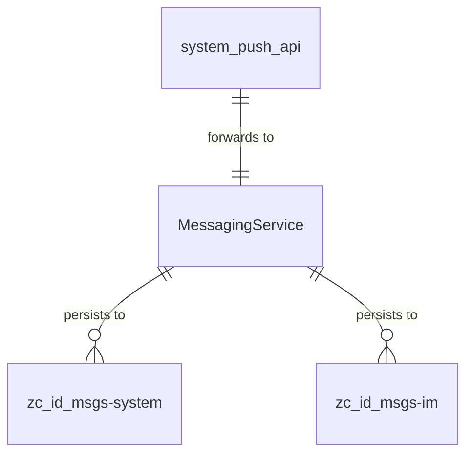

# System Push 本体规约 — Gateway 系统推送服务

> **归属**: Gateway 基础设施（`Gateway/backend/src/api/system_push.rs`）
> **路由前缀**: `/api/system-push`
> **DB Schema**: 无直接持久化（纯推送通道，消息最终写入 `zc_id_message` 继承链）
> **Alioth 模型版本**: v10.0.0+

## 1. 领域概述

Gateway 系统推送 API 提供统一的站内信和设备通知发送通道。所有模块和基础设施通过此 API 发送消息，无需各自对接 `MessagingService`。

**核心能力**:

- 站内信单播/广播（IM notification）
- 分级告警推送（alert: critical/warning/info）
- 设备推送（broadcast/group/batch）
- 兼容旧版 `/im/broadcast` API

**架构角色**: 基础设施层 — 作为 `MessagingService` trait 的 HTTP façade。

## 2. 实体定义

### 2.1 推送请求类型（不持久化 — 即时转发到 MessagingService）

#### SystemNotificationRequest — 站内信通知

| 字段        | 类型      | 语义                            | 必填 |
| ----------- | --------- | ------------------------------- | ---- |
| `to`        | `i64[]?`  | 收件人用户 ID 列表（null=广播） | 否   |
| `title`     | `string`  | 消息标题                        | 是   |
| `content`   | `string`  | 消息正文                        | 是   |
| `from_user` | `string?` | 发件人名称（系统默认）          | 否   |

#### AlertRequest — 分级告警

| 字段           | 类型                                 | 语义                  | 必填 |
| -------------- | ------------------------------------ | --------------------- | ---- |
| `level`        | `AlertLevel` (critical/warning/info) | 告警级别              | 是   |
| `title`        | `string`                             | 告警标题              | 是   |
| `content`      | `string`                             | 告警详情              | 是   |
| `target_users` | `i64[]?`                             | 目标用户（null=全站） | 否   |
| `source`       | `string?`                            | 告警来源模块          | 否   |

#### DeviceBroadcastRequest / DeviceGroupRequest / DeviceBatchRequest — 设备推送

| 字段         | 类型        | 语义                       |
| ------------ | ----------- | -------------------------- |
| `title`      | `string`    | 推送标题                   |
| `body`       | `string`    | 推送正文                   |
| `group`      | `string?`   | 设备分组名（group 模式）   |
| `device_ids` | `string[]?` | 设备 ID 列表（batch 模式） |
| `qos`        | `u8`        | QoS 等级（默认 1）         |

### 2.2 持久化消息（发送后写入 zc_id_message 继承链）

推送发送后，由 `MessagingService` 实现决定是否持久化到对应的 `zc_id_msgs-*` 叶表：

| 推送类型         | 目标叶表                                                    | 写入时机 |
| ---------------- | ----------------------------------------------------------- | -------- |
| IM notification  | `zc_id_msgs-system` (系统通知) / `zc_id_msgs-im` (即时消息) | 同步写入 |
| Alert            | `zc_id_msgs-system`                                         | 同步写入 |
| Device broadcast | 不持久化（仅推送通道）                                      | —        |
| Email（未来）    | `zc_id_msgs-email`                                          | 异步写入 |

### 2.3 MessagingService — 推送 Seam

详见 `Gateway/backend/src/api/ONTOLOGY_SPEC.md §2.3` 和 `Framework/backend/common/src/messaging.rs`。

## 3. 关系图

## 4. API ↔ Seam 映射

| 端点                                | Method | → MessagingService 方法                        |
| ----------------------------------- | ------ | ---------------------------------------------- |
| `/api/system-push/im/notification`  | POST   | `send_system_notification(to, title, content)` |
| `/api/system-push/im/broadcast`     | POST   | `broadcast(title, content)` (兼容旧版)         |
| `/api/system-push/im/alert`         | POST   | `send_alert(level, title, content)`            |
| `/api/system-push/device/broadcast` | POST   | `broadcast_device(title, body)`                |
| `/api/system-push/device/group`     | POST   | `send_device_group(group, title, body)`        |
| `/api/system-push/device/batch`     | POST   | `send_device_batch(device_ids, title, body)`   |

## 6. 已知问题

| #   | 问题                                                                  | 严重度 | 位置                    |
| --- | --------------------------------------------------------------------- | ------ | ----------------------- |
| 1   | `MessagingService` 未注入实现，所有接口返回 400 "service unavailable" | **P0** | `main.rs:311`           |
| 2   | 前端站内信发送 UI 存在但未连接到 `/api/system-push/im/notification`   | **P1** | 开发计划 G7             |
| 3   | 消息写入 `zc_id_message` 继承链的具体实现未在 Gateway 中完成          | **P1** | `MessagingService` impl |
