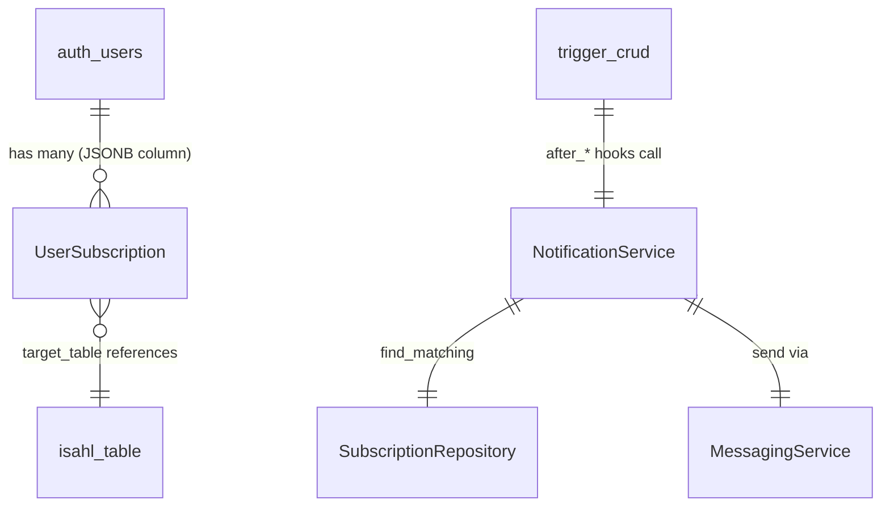

# Notification 本体规约 — Gateway 通知订阅服务

> **归属**: Gateway 基础设施（`Gateway/backend/src/notification/`）
> **路由前缀**: `/api/notifications`
> **DB Schema**: `isahl_auth`（用户订阅） + `isahl`（被订阅的业务表）
> **Alioth 模型版本**: v10.0.0+

## 1. 领域概述

Gateway 通知中心提供用户级数据变更订阅管理。用户在模块工作区对特定表的变更事件（insert/update/delete）注册订阅，数据变更时自动推送站内信。

**核心能力**:

- 用户订阅 CRUD（管理关注的数据变更事件）
- 数据变更自动匹配订阅 → 推送站内信
- 与 `trigger_crud` 联动，在 INSERT/UPDATE/DELETE 的 after 阶段自动触发

**架构角色**: 基础设施层 — 不绑定特定模块/Scene，跨全部 Module 共享。

## 2. 实体定义

### 2.1 UserSubscription — 用户订阅（JSONB 存储于 auth_users）

> ⚠️ **当前状态**: `auth_users` 表不存在 `subscriptions` 列。`SubscriptionRepository` 的所有操作（`list_by_user`, `find_matching_subscriptions`, `create`, `update`, `delete`）均会失败。
>
> **前置条件**: 必须先执行 DDL 迁移添加 `subscriptions` 列，本体映射才可生效。

**目标 DDL**:

```sql
ALTER TABLE isahl_auth.auth_users
ADD COLUMN subscriptions JSONB DEFAULT '[]'::jsonb;
```

**目标 JSONB Schema**（`auth_users.subscriptions: UserSubscription[]`）:

| JSON 字段      | 类型                | 业务语义                                       | 约束                                |
| -------------- | ------------------- | ---------------------------------------------- | ----------------------------------- |
| `id`           | `string` (UUID v4)  | 订阅唯一标识                                   | 客户端或后端生成                    |
| `target_table` | `string`            | 被订阅的业务表名（如 `"zc_id_proc-purchase"`） | 必填                                |
| `target_id`    | `number?`           | 被订阅的特定行 ID（null 表示关注整表）         | 可选                                |
| `event_types`  | `string[]`          | 关注的事件类型                                 | 默认 `["insert","update","delete"]` |
| `notice`       | `string?`           | 订阅备注/标签                                  | 可选                                |
| `is_active`    | `boolean`           | 是否启用                                       | 默认 true                           |
| `created_at`   | `string` (ISO 8601) | 订阅创建时间                                   | 必填                                |

### 2.2 被订阅的业务表（动态范围）

订阅可指向 `isahl` schema 中任意业务表（继承自 `zc_id_lifecycle`）。常见目标：

| 表                       | 业务语义 | 典型订阅场景     |
| ------------------------ | -------- | ---------------- |
| `zc_id_proc-purchase`    | 采购流程 | 采购单变更通知   |
| `zc_id_appr-purchase`    | 采购审批 | 审批状态变更通知 |
| `zc_id_cont-purchase`    | 采购合同 | 合同签署通知     |
| `zc_id_deta-trade_order` | 交易订单 | 订单状态变更通知 |

### 2.3 MessagingService — 推送通道（Seam）

| 方法                       | 参数                                            | 语义                 |
| -------------------------- | ----------------------------------------------- | -------------------- |
| `send_system_notification` | `to: i64[], title: &str, content: &str`         | 向指定用户发送站内信 |
| `send_alert`               | `level: AlertLevel, title: &str, content: &str` | 发送分级告警         |
| `broadcast`                | `title: &str, content: &str`                    | 全站广播             |

**当前状态**: Gateway 启动时 `MessagingService` 为 `None`，`trigger_crud` 的 `after_*` 推送调用静默跳过。需接入实际实现。

## 3. 关系图



## 4. API DTO → DB 映射

### 4.1 GET /notifications/subscriptions

```
SubscriptionListResponse
└── items: Vec<UserSubscription>
    ├── id              ← JSONB.id
    ├── target_table    ← JSONB.target_table
    ├── target_id       ← JSONB.target_id
    ├── event_types     ← JSONB.event_types
    ├── notice          ← JSONB.notice
    ├── is_active       ← JSONB.is_active
    └── created_at      ← JSONB.created_at
```

### 4.2 POST /notifications/subscriptions

```
CreateSubscriptionRequest → UserSubscription
├── target_table  → target_table  (必填)
├── target_id     → target_id     (可选)
├── event_types   → event_types   (默认 ["insert","update","delete"])
└── notice        → notice        (可选)
```

### 4.3 数据变更通知链路（自动触发）

```
trigger_crud::execute_after_insert/update/delete
  → NotificationService.notify_data_change(table_name, record_id, op, record)
    → SubscriptionRepository.find_matching_subscriptions(table, op)
      → SQL: SELECT id, jsonb_array_elements(subscriptions)
              FROM isahl_auth.auth_users
              WHERE subscriptions @> '[{"target_table": "...", "event_types": ["..."]}]'
                AND is_active = true
    → 过滤 target_id 精确匹配
    → MessagingService.send_system_notification(to, title, content)
```

## 6. 已知问题

| #   | 问题                                               | 严重度 | 位置                                            |
| --- | -------------------------------------------------- | ------ | ----------------------------------------------- |
| 1   | `auth_users.subscriptions` 列不存在，需 DDL 迁移   | **P0** | `notification/repository.rs`                    |
| 2   | `MessagingService` 未注入实现，推送静默跳过        | **P0** | `main.rs:311`                                   |
| 3   | 订阅匹配查询性能 — `jsonb_array_elements` 全表扫描 | **P2** | `repository.rs` → `find_matching_subscriptions` |
| 4   | 无前端订阅管理 UI                                  | **P2** | 开发计划 G9                                     |
