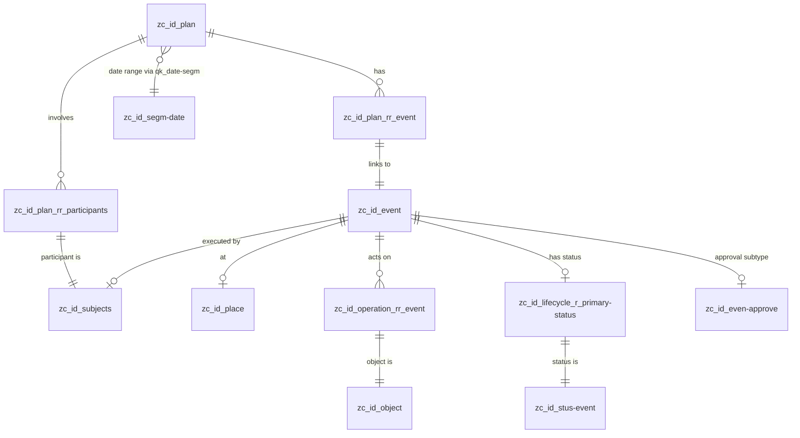

# Schedule 本体规约 — Gateway WorkspaceDock 日程管理

> **归属**: Gateway 内部模块（`Gateway/backend/src/schedule/`）
> **路由前缀**: `/api/schedule`
> **DB Schema**: `isahl`
> **Alioth 模型版本**: v10.0.0+

## 1. 领域概述

Gateway WorkspaceDock 的「日程」面板。提供用户级日程事件与待办事项的通用管理能力，跨所有 Module/App 共享。

**核心能力**:

- 日程计划 CRUD（`zc_id_plan` 父表为根，C 操作在叶表）
- 待办清单（基于 `zc_id_event`，关联主体/状态/客体）
- 日程概览（今日计划数、待办数、即将开始的计划）
- 审批联动（日程可关联审批事件 `zc_id_even-approve`）

**C 操作原则**: INSERT 必须在叶表（`zc_id_plan-personal` / `zc_id_even-alert`）。RUD 走父表（`zc_id_plan` / `zc_id_event`），`tableoid` 区分来源叶表。

## 2. 实体定义

### 2.1 zc_id_plan — 日程计划（父表，RUD 目标）

继承链：`zc_id_lifecycle` ← `zc_id_plan`

| DB 列          | 类型                             | 映射 DTO 字段                    | 业务语义                            |
| -------------- | -------------------------------- | -------------------------------- | ----------------------------------- |
| `id`           | `bigint PK`                      | `ScheduleItemResponse.id`        | 计划 ID                             |
| `notice`       | `text`                           | `ScheduleItemResponse.title`     | 标题                                |
| `code`         | `text`                           | `ScheduleItemResponse.item_type` | 业务类型（meeting/sync/client/...） |
| `_f_`          | `text`                           | —                                | 触发器自动赋值（创意/设计/实现）    |
| `_t_`          | `text`                           | —                                | 触发器自动赋值（范例/实例）         |
| `comments`     | `text`                           | `ScheduleItemResponse.reminder`  | 扩展元数据（reminder JSON：`{"reminder_offset_min": N}`） |
| `exclude`      | `json`                           | —                                | 排除日期                            |
| `sort`         | `bigint`                         | —                                | 排序权重                            |
| `qk_date-segm` | `bigint FK → zc_id_segm-date.id` | `DateTimeSpanResponse.date_*`    | 日期段引用                          |
| `qk_time-segm` | `bigint FK → zc_id_segm-date.id` | `DateTimeSpanResponse.time_*`    | 时间段引用                          |
| `created_at`   | `timestamptz`                    | —                                | 创建时间                            |
| `updated_at`   | `timestamptz`                    | —                                | 更新时间                            |
| `deleted_at`   | `timestamptz`                    | —                                | 软删除时间                          |

叶表：

- `zc_id_plan-personal` — CREATE 目标（个人计划，兜底）
- `zc_id_thre-meeting` — CREATE 目标（会议计划）

### 2.2 zc_id_event — 日程事件（父表，RUD 目标）

继承链：`zc_id_lifecycle` ← `zc_id_event`

| DB 列        | 类型                             | 映射 DTO 字段                   | 业务语义             |
| ------------ | -------------------------------- | ------------------------------- | -------------------- |
| `id`         | `bigint PK`                      | `TodoItemResponse.id`           | 事件 ID              |
| `notice`     | `text`                           | `TodoItemResponse.title`        | 事件标题             |
| `_f_`        | `text`                           | —                               | 触发器自动赋值       |
| `_t_`        | `text`                           | —                               | 触发器自动赋值       |
| `qk_date`    | `bigint FK → zc_id_scal-date.id` | `TodoItemResponse.due_date`     | 截止日期（标量引用） |
| `fk_place`   | `bigint FK → zc_id_place.id`     | `ScheduleItemResponse.location` | 场所引用             |
| `fk_subject` | `bigint FK → zc_id_subjects.id`  | `ScheduleItemResponse.subject`  | 主体/参与人引用      |
| `created_at` | `timestamptz`                    | —                               | 创建时间             |
| `updated_at` | `timestamptz`                    | —                               | 更新时间             |
| `deleted_at` | `timestamptz`                    | —                               | 软删除时间           |

叶表：

- `zc_id_even-alert` — CREATE 目标（提醒事件，兜底）

### 2.3 zc_id_even-approve — 审批事件

继承链：`zc_id_lifecycle` ← `zc_id_event` ← `zc_id_even-approve`

| DB 列    | 类型        | 映射 DTO 字段                  | 业务语义             |
| -------- | ----------- | ------------------------------ | -------------------- |
| `id`     | `bigint PK` | `LinkedApprovalResponse.id`    | 审批 ID（同事件 ID） |
| `notice` | `text`      | `LinkedApprovalResponse.title` | 审批标题             |
| `number` | `text`      | —                              | 审批编号             |

### 2.4 zc_id_segm-date — 时间片段

| DB 列     | 类型          | 映射 DTO 字段                     | 业务语义 |
| --------- | ------------- | --------------------------------- | -------- |
| `id`      | `bigint PK`   | —                                 | 片段 ID  |
| `notice`  | `text`        | —                                 | 名称     |
| `date_st` | `timestamptz` | `DateTimeSpanResponse.date_start` | 开始日期 |
| `date_ed` | `timestamptz` | `DateTimeSpanResponse.date_end`   | 结束日期 |
| `time_st` | `timestamptz` | `DateTimeSpanResponse.time_start` | 开始时间 |
| `time_ed` | `timestamptz` | `DateTimeSpanResponse.time_end`   | 结束时间 |

### 2.5 zc_id_place — 场所

| DB 列    | 类型        | 映射 DTO 字段                   |
| -------- | ----------- | ------------------------------- |
| `id`     | `bigint PK` | —                               |
| `notice` | `text`      | `ScheduleItemResponse.location` |

### 2.6 zc_id_subjects — 主体/参与人

| DB 列    | 类型        | 映射 DTO 字段              |
| -------- | ----------- | -------------------------- |
| `id`     | `bigint PK` | `ParticipantResponse.id`   |
| `notice` | `text`      | `ParticipantResponse.name` |

### 2.7 zc_id_object — 客体（待办关联的工作对象）

| DB 列    | 类型        | 映射 DTO 字段             |
| -------- | ----------- | ------------------------- |
| `id`     | `bigint PK` | `TodoObjectResponse.id`   |
| `notice` | `text`      | `TodoObjectResponse.name` |

### 2.8 zc_id_stus-event — 事件状态

| DB 列    | 类型        | 映射 DTO 字段                    |
| -------- | ----------- | -------------------------------- |
| `id`     | `bigint PK` | —                                |
| `notice` | `text`      | `TodoItemResponse.status`        |
| `flag`   | `text`      | （推导 `TodoItemResponse.done`） |

## 3. 关系表

### 3.1 zc_id_plan_rr_event — Plan ↔ Event 关联

| 列          | 类型                         | 语义    |
| ----------- | ---------------------------- | ------- |
| `ref_left`  | `bigint FK → zc_id_plan.id`  | 计划 ID |
| `ref_right` | `bigint FK → zc_id_event.id` | 事件 ID |

多对多：一个 Plan 可有多个 Event，一个 Event 可关联多个 Plan。

### 3.2 zc_id_plan_rr_participants — Plan ↔ 参与人

| 列          | 类型                            | 语义                                   |
| ----------- | ------------------------------- | -------------------------------------- |
| `ref_left`  | `bigint FK → zc_id_plan.id`     | 计划 ID                                |
| `ref_right` | `bigint FK → zc_id_subjects.id` | 主体 ID                                |
| `resp-type` | `json`                          | 角色类型（`ParticipantResponse.role`） |

### 3.3 zc_id_operation_rr_event — Event ↔ 客体

| 列           | 类型                          | 语义     |
| ------------ | ----------------------------- | -------- |
| `ref_left`   | `bigint FK → zc_id_event.id`  | 事件 ID  |
| `ref_right`  | `bigint FK → zc_id_object.id` | 客体 ID  |
| `r_notice`   | `text`                        | 关联说明 |
| `deleted_at` | `timestamptz`                 | 软删除   |

### 3.4 zc_id_lifecycle_r_primary-status — Event ↔ 主状态

| 列          | 类型                              | 语义    |
| ----------- | --------------------------------- | ------- |
| `ref_left`  | `bigint FK → zc_id_event.id`      | 事件 ID |
| `ref_right` | `bigint FK → zc_id_stus-event.id` | 状态 ID |

## 4. 实体关系图



## 5. API DTO → DB 映射

### 5.1 GET /schedule/overview

```
ScheduleOverviewResponse
├── today_event_count: i64           ← COUNT(zc_id_plan) WHERE date_st IN [today,today+7d]
├── pending_todo_count: i64          ← COUNT(zc_id_event) NOT (status='完成' AND flag='end')
└── upcoming_items: Vec<ScheduleItemResponse>
```

### 5.2 ScheduleItemResponse（主 DTO）

| DTO 字段          | 来源                         | SQL 表达式/说明                                  |
| ----------------- | ---------------------------- | ------------------------------------------------ |
| `id`              | `zc_id_plan.id`              | `p.id as plan_id`                                |
| `item_type`       | `zc_id_plan.code`            | `p.code as plan_type`                            |
| `span.date_start` | `zc_id_segm-date.date_st`    | JOIN `ds.date_st`                                |
| `span.date_end`   | 同上 `date_ed`               | JOIN `ds.date_ed`                                |
| `span.time_start` | 同上 `time_st`               | JOIN `ds.time_st`                                |
| `span.time_end`   | 同上 `time_ed`               | JOIN `ds.time_ed`                                |
| `duration`        | 计算字段                     | `time_ed - time_st` 分钟数；cron 存在时="周期性" |
| `location`        | `zc_id_place.notice`         | LEFT JOIN `pl.notice`                            |
| `subject`         | `zc_id_subjects.notice`      | LEFT JOIN `s.notice`                             |
| `participants`    | `zc_id_plan_rr_participants` | 二次查询: `WHERE ref_left = plan_id`             |
| `linked_approval` | `zc_id_even-approve` + `r_primary-status`→`zc_id_stus-approve` | LEFT JOIN `a.notice, a.id` + 状态子查询 `st.code` |

### 5.3 TodoItemResponse

| DTO 字段  | 来源                                                               |
| --------- | ------------------------------------------------------------------ |
| `id`      | `zc_id_event.id`                                                   |
| `title`   | `zc_id_event.notice`                                               |
| `subject` | `zc_id_subjects.notice` (via `fk_subject`)                         |
| `status`  | `zc_id_stus-event.notice` (via `zc_id_lifecycle_r_primary-status`) |
| `done`    | 推导: `st.notice='完成' AND st.flag='end'`                         |
| `objects` | 二次查询: `zc_id_operation_rr_event → zc_id_object`                   |

## 6. C 操作叶表映射

| 操作           | 当前                  | 目标叶表              | 说明         |
| -------------- | --------------------- | --------------------- | ------------ |
| `create_plan`  | `zc_id_plan-personal` | `zc_id_plan-personal` | 个人计划兜底 |
| `create_event` | `zc_id_even-alert`    | `zc_id_even-alert`    | 提醒事件兜底 |

RUD 均走父表（`zc_id_plan` / `zc_id_event`），查询含 `p.tableoid::regclass::text` 标识来源叶表。

## 7. 核心查询模式

### 7.1 日程项列表（组装查询）

```
zc_id_plan p
  → LEFT JOIN zc_id_plan_rr_event pre ON pre.ref_left = p.id
    → LEFT JOIN zc_id_event e ON e.id = pre.ref_right AND e.deleted_at IS NULL
      → LEFT JOIN zc_id_place pl ON pl.id = e.fk_place
      → LEFT JOIN zc_id_subjects s ON s.id = e.fk_subject
      → LEFT JOIN zc_id_even-approve a ON a.id = e.id
  → LEFT JOIN zc_id_segm-date ds ON ds.id = COALESCE(p."qk_date-segm", p."qk_time-segm")
WHERE p.deleted_at IS NULL
  [AND (p.code = 'type' OR p._t_ = 'type')]  -- 可选类型过滤，兼容新旧
ORDER BY ds.date_st ASC, ds.time_st ASC, p.sort ASC
```

### 7.2 待办列表

```
zc_id_event e
  → LEFT JOIN zc_id_subjects s ON s.id = e.fk_subject
  → LEFT JOIN zc_id_lifecycle_r_primary-status ps ON ps.ref_left = e.id
    → LEFT JOIN zc_id_stus-event st ON st.id = ps.ref_right
WHERE e.deleted_at IS NULL
ORDER BY e.qk_date ASC, e.created_at DESC
```

### 7.3 事件客体列表（二次查询）

```
zc_id_operation_rr_event eo
  → JOIN zc_id_object o ON o.id = eo.ref_left
WHERE eo.ref_right = $event_id AND eo.deleted_at IS NULL
```

## 8. 客体类型推断逻辑

`TodoItemResponse.objects[].object_type` 由客体名称前缀推导：

| 条件                                                                          | 类型值         |
| ----------------------------------------------------------------------------- | -------------- |
| `notice` 精确匹配「实现-单据」「单据-清算账单」「单据-价格清单」「实现-发票」 | `"bill"`       |
| `notice` 精确匹配「实现-产品」或 `产品-*` 系列（约 15 种子类）                | `"production"` |
| `notice` 以「产品-」或「zc_id_prod-」开头                                     | `"production"` |
| `notice` 以「单据-」或「zc_id_bill」开头                                      | `"bill"`       |
| 其他                                                                          | `"other"`      |

## 9. 审批联动

`ScheduleItemResponse.linked_approval` 通过 `zc_id_even-approve` 子表 JOIN 实现：

- 当 `zc_id_event` 的行在 `zc_id_even-approve` 中有对应记录时，视为审批事件
- 审批状态经 `zc_id_lifecycle_r_primary-status` → `zc_id_stus-approve.code` 子查询解析（pending/approved/rejected；无桥接行为 `NULL`）
- 标题取 `zc_id_even-approve.notice`
- 关联 ID 取 `zc_id_event.id`
